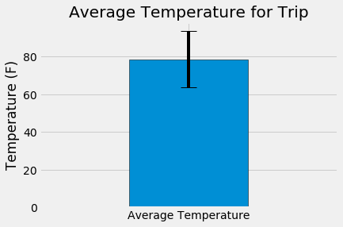

# sqlalchemy-challenge
## [Database](hawaii.sqlite)
Sqlite database of precipitation and temperature data from various weather station sin Hawaii.
## [App](app.py)
Python application that uses flask to create an API server to parse through the [Hawaii sqlite](hawaii.sqlite) database.
## [Trip Weather Check](climate.ipynb)
Jupyter Notebook used to create various analysis, tables, and charts describing the potential weather in Hawaii during the allotted trip time (2018-08-09 to 2018-08-23) using the data from the previous year. The data for these analyses was retrieved from the [Hawaii sqlite](hawaii.sqlite) database.
## [Charts](charts)
Directory containing charts describing various weather statistics made from the [climate](climate.ipynb) jupyter notebook.
### [Daily Precipitation](charts/dailyprcp.png)

Bar chart showing the daily precipitation in inches over the last 12 months of data.
### [Temperature Frequency](charts/tempfreq.png)

 Histogram showing how often, within the last 12 months of data, a day's temperature was in a certain range.
### [Average Trip Temperature](charts/tripTemp.png)

 Bar chart showing the Average potential temperature over the length of the trip with error bars.
### [Normal Daily Precipitation](charts/areaOfNormals.png)

 Area chart showing the minimum, maximum, and average daily precipitation projected for the length of the trip. 
## Built With
* Python
* Jupyter Notebook
* [hawaii.sqlite](hawaii.sqlite)
## Author
Ryan Klueg
